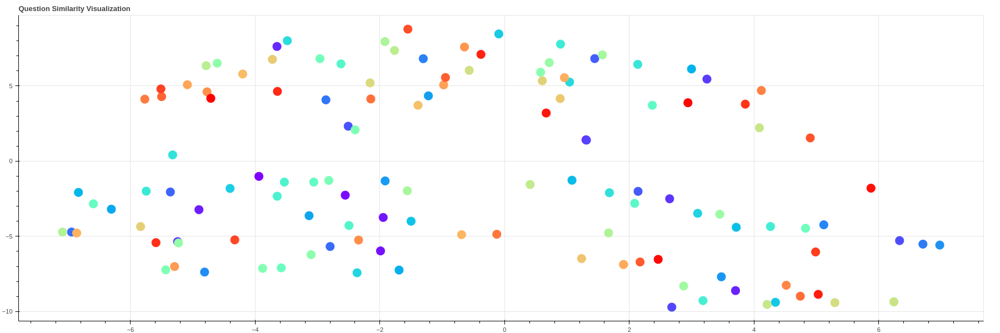

# Frequently Asked Questions Extractor

a notebook that leverage the power of NLP and Unsupervised learning in order to extract the most asked question from a huge corpus of question.

 

  <h3 align="center">Frequently Asked Questions Extractor</h3>

  

    A notebook that leverage the power of NLP and clustering in order to extract the most asked question from a huge corpus of question.
     
     
  

## Table Of Contents

* [About the Project](#about-the-project)
* [Built With](#built-with)
* [Results](#results)
* [Authors](#authors)

## About The Project

This project focuses on using advanced natural language processing techniques to extract and cluster frequently asked questions from a company's website. By generating an initial set of 130 potential questions, representing them numerically with pretrained BERT models, calculating their semantic similarity, and applying HDBSCAN clustering, we aim to automate the creation of a comprehensive FAQ section, ultimately improving customer support and enhancing the user experience on the company's website.

## Built With

This project is built with a powerful stack of tools, including :

* [Python]()
* [PyTorch]()
* [SentenceTransformer (BERT Model)]()
* [T-SNE for Dimensionality reduction]()
* [HDBSCAN for Clustering]()
* [Bokeh for Data visualization]()

## Results

This is a brief summary of the results :

| Cluster name | Questions |
| --- | ----------- |
| cluster_28 | Can you provide information on your room types? Is room keycard access required for specific hotel areas? Can I request a specific floor or room location? Are there any security measures in place within the hotel? |
| cluster_29 | What are your hotel's check-in and check-out timings? How can I access the hotel's guest reviews? How can I access the hotel's event calendar? How can I receive notifications about hotel promotions? Can I participate in a hotel loyalty program upon check-in? How can I access the hotel's VIP or concierge lounge? How can I access information on hotel awards and accolades? How can I access information on hotel partnerships or affiliations? |
| cluster_6 | Are there any extended stay discounts available? What's the process for extending my stay? |
| cluster_19 | Is there a fitness facility or gym within the hotel premises? Is there a pool or spa on the hotel premises? How do I access the hotel's spa or wellness center? Are there options for in-room massages or spa treatments? |
| cluster_3 | How do I request a late check-out? Can I request a late-night check-in or early check-out? Is there a security escort service for late-night arrivals? |
| cluster_1 | Is there an airport shuttle service available? Do you provide airport pick-up services? Is there a helipad or space for helicopter arrivals? |
| cluster_13 | May I reserve a room with a scenic view? Can I book a room with a balcony or terrace? |

## Authors

* **Yassine DRISS** - *Final year AI and Data science student* - [Yassine DRISS](https://github.com/cinex10)

